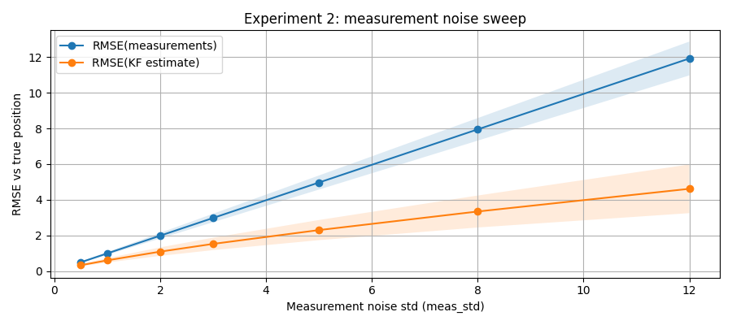

# kalman-project
Demonstration of Kalman filter behavior on simple controlled motion models.

The goal of this project is not performance, but to build intuition about:

- when and why a Kalman filter improves noisy measurements,
- how assumptions about noise affect estimation quality,
- how model mismatch degrades or preserves performance.

## Environment setup
Sync environment with development and notebook extras
```
uv sync --extra dev --extra notebooks
```
Install pre-commit hooks
```
uv run pre-commit install
```

## 1d motion
We consider a one-dimensional point mass with:

- state: position and velocity
- input: commanded acceleration
- measurement: noisy position only

The system is simulated with known ground truth, allowing quantitative error evaluation.

State vector:
$$x_k = \begin{bmatrix} p_k \\ v_k \end{bmatrix}$$

State transition model:
$$x_{k+1} = F x_k + B u_k + w_k$$

Measurement model:
$$z_k = H x_k + v_k$$

### Experiment 1: does the Kalman filter help?

Purpose is to establish a minimal baseline by comparing raw noisy measurements with Kalman filter position estimates.

This experiment answers the question: Does the Kalman filter improve estimation accuracy at all under ideal assumptions?

**Configurable parameters**

You can adjust these directly in `experiments/1d_exp1_basic_demo.py`:
- Number of steps ($n_{steps}$) - length of the simulated trajectory - Default: 40
- Process noise / acceleration std ($\sigma_a$) - models uncommanded acceleration disturbances (e.g. wind) - Default: 0.05
- Measurement noise ($\sigma_v$) - standard deviation of position measurements - Default: 3.0
- Commanded acceleration ($u_k$) - piecewise-constant acceleration input controlling motion

**Evaluation metric**

Accuracy is evaluated using Root Mean Squared Error (RMSE):
- $\mathrm{RMSE}_{meas} = \sqrt{\frac{1}{N}\sum_k (z_k - p_k)^2}$
- $\mathrm{RMSE}_{KF} = \sqrt{\frac{1}{N}\sum_k (\hat{p}_k - p_k)^2}$

This allows a direct, quantitative comparison between using measurements alone and using the Kalman filter estimate.

**Output**

Below is a sample run showing how the filter estimates position and velocity from noisy position measurements while tracking the commanded acceleration input.


```
RMSE(measurements vs true position): 3.123
RMSE(KF estimate vs true position): 1.600
Improvement factor (meas / kf): 1.95x 
```

The Kalman filter significantly reduces estimation error by combining the motion model, noisy observations and uncertainty propagation.

**How to run**

```
uv run python experiments/1d_exp1_basic_demo.py
```

---
### Experiment 2: Noise sweep — measurement noise vs performance

**Purpose:** show that the Kalman filter helps more when measurements are noisy.

In this experiment we sweep the measurement noise standard deviation $\sigma_v$ (parameter `meas_std`) over a predefined range, while keeping the process noise $\sigma_a$ fixed.

For each value of $\sigma_v$, multiple independent simulation runs are performed using different random seeds. For each run, we compute the following error metrics:

* $\mathrm{RMSE}_{meas} = \sqrt{\frac{1}{N}\sum_k (z_k - p_k)^2}$
* $\mathrm{RMSE}_{KF} = \sqrt{\frac{1}{N}\sum_k (\hat{p}_k - p_k)^2}$

where:

* $p_k$ is the true position  
* $z_k$ is the noisy measurement  
* $\hat{p}_k$ is the Kalman filter position estimate  

**Experimental setup**

* Process noise standard deviation $\sigma_a$ is fixed
* Measurement noise standard deviation $\sigma_v$ is swept over a range
* Kalman filter uses the *same* process noise model as the data generator
* Multiple Monte Carlo trials are run per noise level

This isolates the effect of measurement noise on filter performance.

**Output**



```
meas_std=  0.5 |        RMSE_meas=0.497 ± 0.040 |       RMSE_KF=0.332 ± 0.061 | impr=1.50x
meas_std=  1.0 |        RMSE_meas=0.993 ± 0.079 |       RMSE_KF=0.605 ± 0.122 | impr=1.64x
meas_std=  2.0 |        RMSE_meas=1.987 ± 0.158 |       RMSE_KF=1.092 ± 0.238 | impr=1.82x
meas_std=  3.0 |        RMSE_meas=2.980 ± 0.237 |       RMSE_KF=1.527 ± 0.349 | impr=1.95x
meas_std=  5.0 |        RMSE_meas=4.967 ± 0.395 |       RMSE_KF=2.301 ± 0.564 | impr=2.16x
meas_std=  8.0 |        RMSE_meas=7.947 ± 0.632 |       RMSE_KF=3.342 ± 0.896 | impr=2.38x
meas_std= 12.0 |        RMSE_meas=11.920 ± 0.948 |      RMSE_KF=4.615 ± 1.365 | impr=2.58x
```

As $\sigma_v$ increases, raw measurement accuracy degrades approximately linearly with noise magnitude. The Kalman filter increasingly outperforms raw measurements by exploiting the motion model and temporal consistency. This experiment demonstrates that the Kalman filter provides the greatest benefit when measurements are highly noisy.

**How to run**

```bash
uv run python experiments/1d_exp2_measurement_noise.py
```