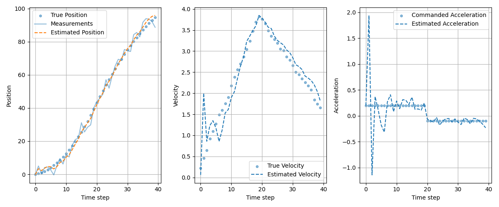

# kalman-project
Demonstration of Kalman filter behavior on simple controlled motion models.

The goal of this project is not performance, but to build intuition about:

- when and why a Kalman filter improves noisy measurements,
- how assumptions about noise affect estimation quality,
- how model mismatch degrades or preserves performance.

## Environment setup
Sync environment with development and notebook extras
```
uv sync --extra dev --extra notebooks
```
Install pre-commit hooks
```
uv run pre-commit install
```

## 1d motion
We consider a one-dimensional point mass with:

- state: position and velocity
- input: commanded acceleration
- measurement: noisy position only

The system is simulated with known ground truth, allowing quantitative error evaluation.

State vector:
$$x_k = \begin{bmatrix} p_k \ v_k \end{bmatrix}$$

State transition model:
$$x_{k+1} = F x_k + B u_k + w_k$$

Measurement model:
$$z_k = H x_k + v_k$$

### Baseline experiment: does the Kalman filter help?

Purpose is to establish a minimal baseline by comparing raw noisy measurements with Kalman filter position estimates.

This experiment answers the question: Does the Kalman filter improve estimation accuracy at all under ideal assumptions?

#### Running the experiment

`run_1d.py` models the one-dimensional movement of an object with commanded acceleration input.
```
uv run python examples/run_1d.py
```
**Configurable parameters**

You can adjust these directly in `run_1d.py`:
- Number of steps ($n_{steps}$) - length of the simulated trajectory - Default: 40
- Process noise / acceleration std ($\sigma_{\omega}$) - models uncommanded acceleration disturbances (e.g. wind) - Default: 0.05
- Measurement noise ($\sigma_v$) -s tandard deviation of position measurements - Default: 3.0
- Commanded acceleration ($u_k$) - piecewise-constant acceleration input controlling motion

**Evaluation metric**

Accuracy is evaluated using Root Mean Squared Error (RMSE):
- $\mathrm{RMSE}_{meas} = \sqrt{\frac{1}{N}\sum_k (z_k - p_k)^2}$
- $\mathrm{RMSE}_{KF} = \sqrt{\frac{1}{N}\sum_k (\hat{p}_k - p_k)^2}$

This allows a direct, quantitative comparison between using measurements alone and using the Kalman filter estimate.

### Example output
Below is a sample run showing how the filter estimates position and velocity from noisy position measurements while tracking the commanded acceleration input.



- RMSE(measurements vs true position): 3.123
- RMSE(KF estimate vs true position): 1.600
- Improvement factor (meas / kf): 1.95x 

The Kalman filter significantly reduces estimation error by combining the motion model, noisy observations and uncertainty propagation.